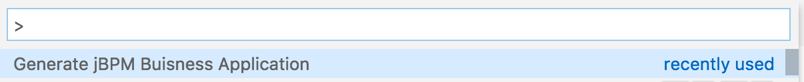

# jbavsc

Extension used to generate your jBPM Business Application in the
current working directory.

To generate your app via Web use: [start.jbpm.org](start.jbpm.org).
To generate your app via command-line use: [https://www.npmjs.com/package/jba-cli](https://www.npmjs.com/package/jba-cli).

## How to use

1. Make sure you are in a workspace (directory) where you would like to generate your jBPM Business Application.
2. Open the Command Palette (⇧⌘P on OSX for example). Enter in command:

```
> Generate jBPM Business Application
```



## Generation Options

You can chose to either generate your application using default settings, or can customize it via configurations:


Selecting the configuration generation option will guide you though a number of steps and then generate your business application in the current working directory.

## App generation via Configuration

If you chose to configure your jBPM Business app you want to generate you
will be guided through a 5 step process:

1. Application type: Here you can pick what app type you want to generate. Options are "Business Automation", "Decision Management", and "Business Optimization".


2. Application name: Enter your application name here, or leave the default "business-application" entry.


3. Application package name: Enter your application package name here, or leave the default "com.company" entry.


4. Application KIE version: Pick from one of the KIE versions. If the version you want to use is not available (we will update the versions as we update this extension in the future) you can always change it in your generated application pom.xml files.


5. Application components: Select one of the two availabe application components. If you would like to develop processes that use Case Management you should select the dynamic assets.


## Generated app in your working directory

After the generation process this extension will generate your jBPM Business app zip file and also extract it into your current working directory. You will see the generated app modules:


